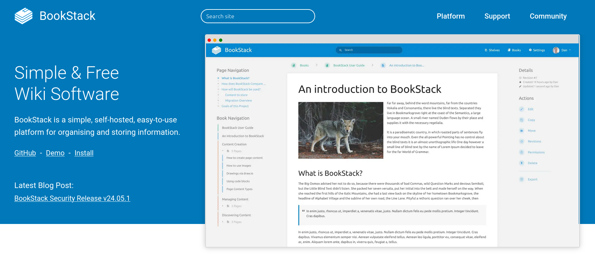
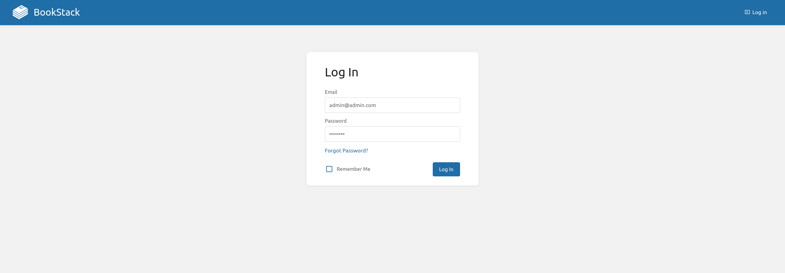
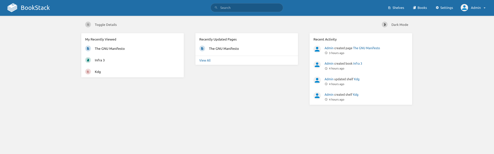
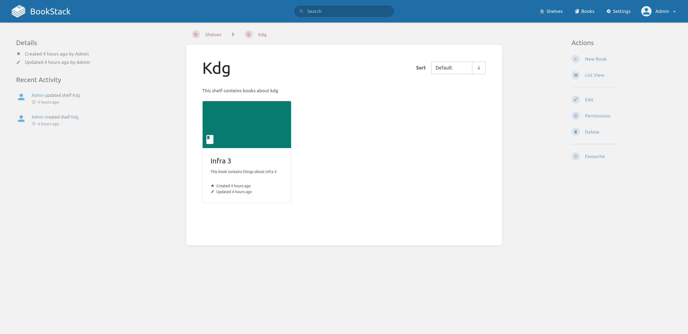
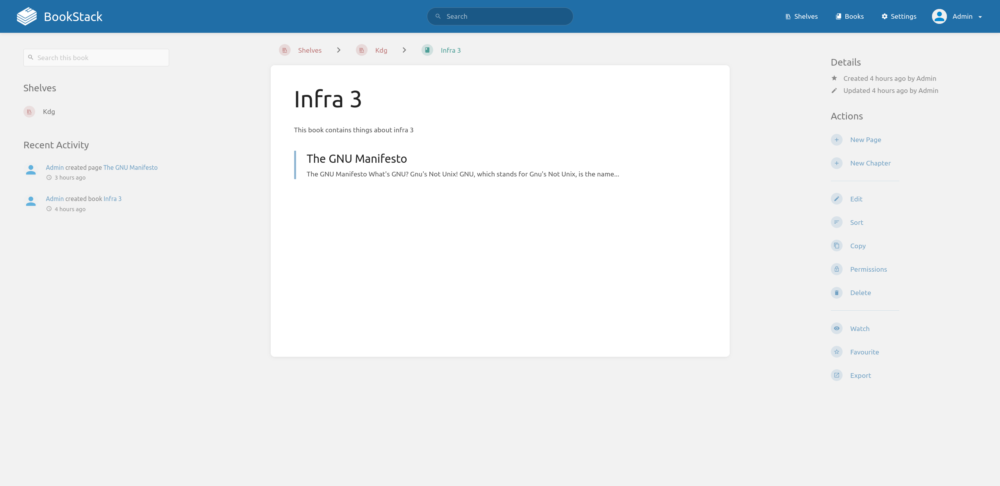
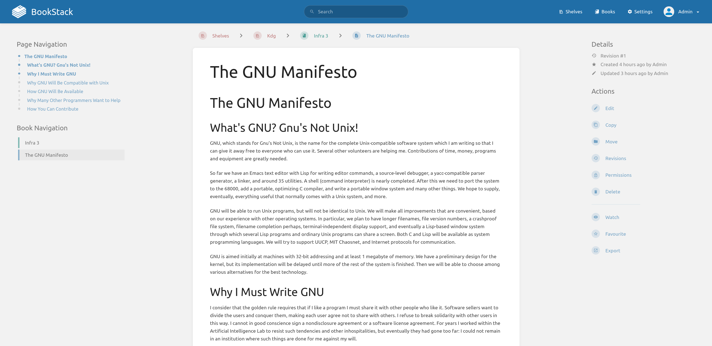

# Infrastructure Project Readme

## Introduction



BookStack is an open-source platform designed for creating, organizing, and managing documentation and knowledge bases. 

It offers a user-friendly interface for writing and organizing content into books, chapters, and pages, making it ideal for team collaboration and personal documentation needs. 

With its intuitive design, BookStack allows users to easily navigate, search, and maintain their information, ensuring efficient knowledge management and sharing.

This project aims to deploy a Bookstack instance using 3 Docker containers. 

## Overview

The infrastructure consists of three main components:

- **Caddy**: A web server acting as a reverse proxy to serve the Bookstack application over HTTPS.
- **Bookstack**: A containerized instance of Bookstack.
- **MariaDB**: A database to save the BookStack data.

The containers are communicating between each-other internally using a docker network called `bookstack_network`.

Each container saves its data in a volume present in this folder to persist the data between container restarts:

- `./bookstack` folder for the Bookstack container
- `./mariadb` folder for the MariaDB database container
- `./caddy` folder for the Caddy server container
  - Inside the `./caddy` folder, there is a `Caddyfile` that contains the configuration for the Caddy server.

### Caddy config:
```
{
	debug // Enable debug mode
}

localhost:443 {
        reverse_proxy bookstack:80 // Forward HTTPS requests to Bookstack
        tls internal // Use self-signed certificate
}
```

The Caddy server is configured to serve the Bookstack application over HTTPS using a self-signed certificate (generated automatically).

The only port exposed is the port `80` and `443` of the Caddy container (to localhost).

### Prerequisites:
- `Bash` should be installed in the system (for running the deploy script)
- `Docker` should be installed in the system
- Port `80` and `443` should be available & free in localhost

## How to run this application

The whole deployment process is automated using a bash script called `deploy.sh`.

(to see all the options run `./deploy.sh`|`./deploy help`, or scroll down to the end of this file)

To start the application, simply run the following command:

- `./deploy.sh start`

Expected output:
    
```bash
[antonio@nixos-beldenken:~/IdeaProjects/infra3]$ ./deploy.sh start
📚 Bookstack Docker automation tool 1.0v 📚
-----------------------------------------
🚀 Developed by: Antonio Gagliarducci 🚀
-----------------------------------------
[+] Building 0.0s (0/0)                                                                                                                                                                                                              docker:default
[+] Running 4/4
 ✔ Network infra3_bookstack_network  Created                                                                                                                                                                                                   0.0s 
 ✔ Container bookstack_db            Started                                                                                                                                                                                                   0.0s 
 ✔ Container caddy                   Started                                                                                                                                                                                                   0.0s 
 ✔ Container bookstack               Started                                                                                                                                                                                                   0.0s 
-----------------------------------------
🚚🚚💨 End of the script!
Have a good day :)

```

_After a minute or two, the application should be up and running._

### Credentials:

- **Username**: admin@admin.com
- **Password**: password

Simply open [https://localhost](https://localhost) (http will be redirected), and you will see the Bookstack application.

(note: you will need to accept the self-signed certificate to access the site because it is not signed by a trusted certificate authority)


### Some screenshots of the application:


_Login page_

_Main page_

_Shelf page_

_Book page_

_Article page_

## Commands available in the deploy script

```
Usage: ./deploy.sh {start|stop|logs|logs_caddy|logs_bookstack|logs_bookstack_db|update|restart|status|enter}
Description:
  start                  - Start the Docker Compose service
  stop                   - Stop the Docker Compose service
  logs                   - Show logs of all containers
  logs_caddy             - Show logs of the Caddy container
  logs_bookstack         - Show logs of the Bookstack container
  logs_bookstack_db      - Show logs of the Bookstack DB container
  update                 - Update all containers and restart
  restart                - Restart the Docker Compose service
  status                 - Show status of the Docker Compose service
  enter <container_name> - Enter inside a container [caddy|bookstack|bookstack_db]
  help                   - Show this help message
```

The whole deployment script tries to be as user-friendly as possible, providing a simple interface to manage the containers.